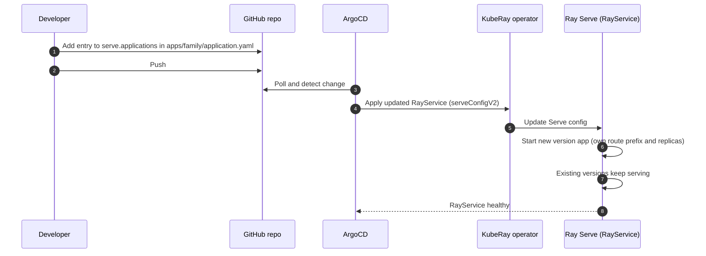

# Adding a model version

```mermaid
sequenceDiagram
    autonumber
    participant Dev as Developer
    participant Git as GitHub repo
    participant Argo as ArgoCD
    participant Ray as KubeRay operator
    participant Serve as Ray Serve (RayService)
    Dev->>Git: Add entry to serve.applications in apps/family/application.yaml
    Dev->>Git: Push
    Argo->>Git: Poll and detect change
    Argo->>Ray: Apply updated RayService (serveConfigV2)
    Ray->>Serve: Update Serve config
    Serve->>Serve: Start new version app (own route prefix and replicas)
    Serve->>Serve: Existing versions keep serving
    Serve-->>Argo: RayService healthy
```

Removing a version is the reverse: delete its entry and push; ArgoCD prunes and Serve stops that application. Rolling back is a `git revert`.
