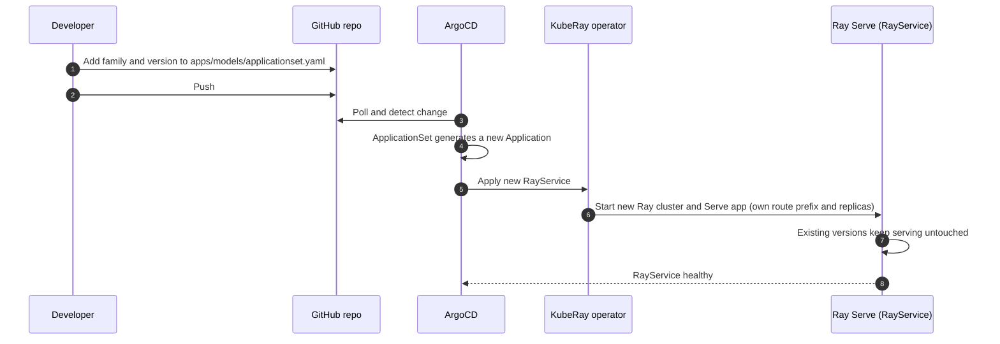

# Adding a model version

```mermaid
sequenceDiagram
    autonumber
    participant Dev as Developer
    participant Git as GitHub repo
    participant Argo as ArgoCD
    participant Ray as KubeRay operator
    participant Serve as Ray Serve (RayService)
    Dev->>Git: Add family and version to apps/models/applicationset.yaml
    Dev->>Git: Push
    Argo->>Git: Poll and detect change
    Argo->>Argo: ApplicationSet generates a new Application
    Argo->>Ray: Apply new RayService
    Ray->>Serve: Start new Ray cluster and Serve app (own route prefix and replicas)
    Serve->>Serve: Existing versions keep serving untouched
    Serve-->>Argo: RayService healthy
```

Removing a version is the reverse: delete its list entry and push; ArgoCD prunes that Application and its RayService. Rolling back is a `git revert`.
